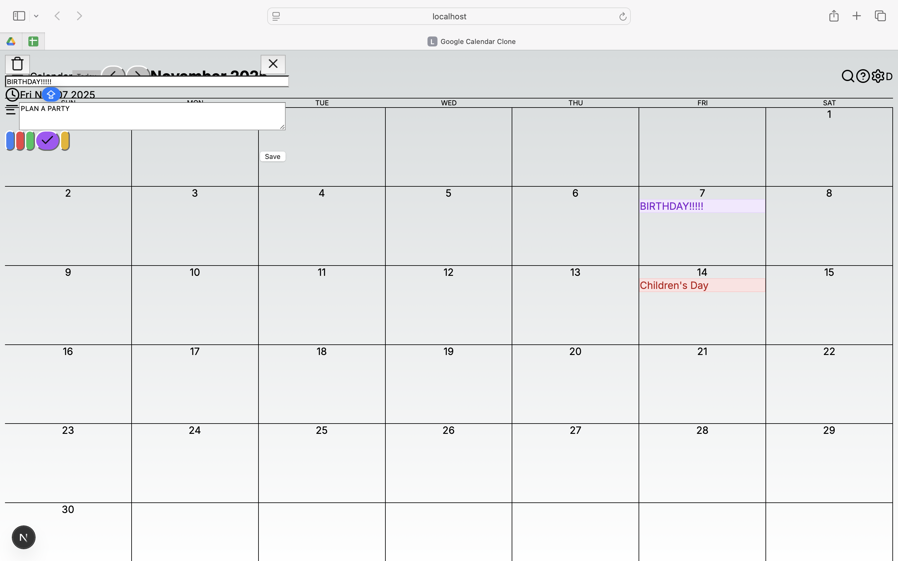

# Google Calendar Clone

A high-fidelity fullstack clone of Google Calendar built with Next.js 14, Tailwind CSS, and SQLite.

## Features
- **Monthly View**: Accurate date grid generation using `date-fns` to match the real Google Calendar logic.
- **Event Management**:
  - **Create**: Click any date to add an event.
  - **Edit**: Click an event to modify details or color.
  - **Delete**: Remove events directly from the modal.
- **Color Coding**: Events can be categorized by 5 distinct colors (Blue, Red, Green, Purple, Yellow).
- **High Fidelity UI**: Pixel-matched styling (fonts, borders, spacing) using Tailwind CSS.

## Architecture & Tech Stack

### 1. Frontend: Next.js (App Router)
- **Framework**: Next.js was chosen for its server-side rendering and efficient routing.
- **Styling**: Tailwind CSS allows for rapid, "utility-first" styling to mimic Google's Material Design exact pixel measurements.
- **Icons**: `lucide-react` provides clean, modern icons (Menu, Chevron, Settings) that resemble Google's native iconography.

### 2. Backend: Next.js API Routes
- **Monorepo Structure**: The backend logic resides in `app/api/` to keep the project lightweight and deployment simple.
- [cite_start]**Database**: **SQLite** was selected as the requested lightweight database[cite: 22].
- **ORM**: **Prisma** is used to interact with the database, ensuring type safety and easy schema management.

### 3. Business Logic
- **Date Generation**: The calendar grid is generated dynamically. `date-fns` calculates the start/end of the current month and fills in the "padding days" from the previous/next month to ensure a complete 7x5 or 7x6 grid.
- **State Management**: React `useState` handles the modal visibility and form inputs, while `useEffect` syncs with the backend API on load and after updates.
- **Conflict Handling**: Multiple events on the same day stack vertically, preserving order based on insertion time.

## Setup & Run Instructions

1. **Clone the repository**
   ```bash
   git clone [https://github.com/YOUR_USERNAME/google-calendar-clone.git](https://github.com/YOUR_USERNAME/google-calendar-clone.git)
   cd google-calendar-clone